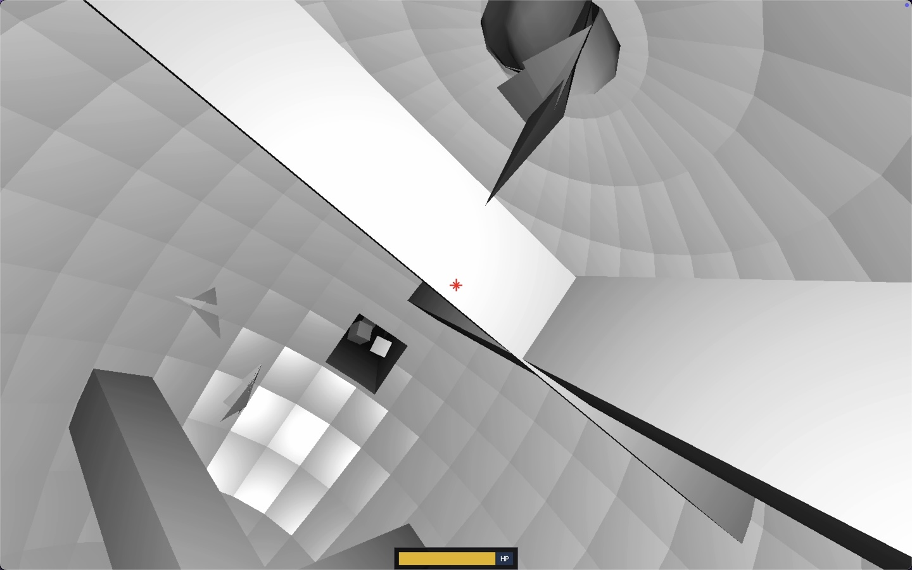
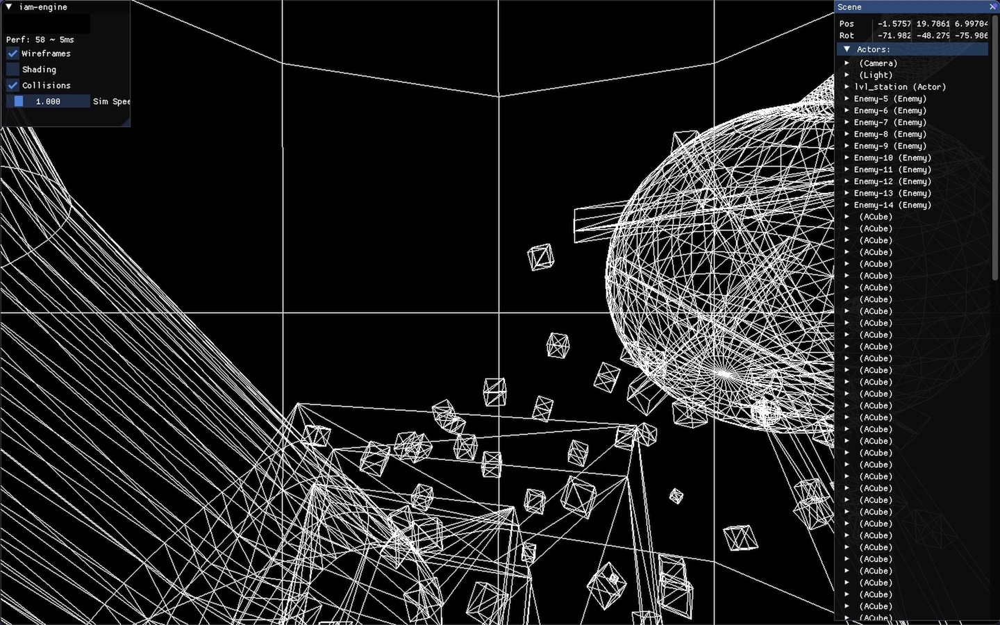

# iam-engine

A handmade, cross-platform, minimalistic game engine for experiments using C++, SDL3, OpenGL, and Bullet Physics.

## Engine Features
- **Hybrid Actor/Entity Component System**
  - Iterate over system components horizontally or per actor vertically.
- **Mesh Component Auto-Instancing**
  - Duplicated meshes are collected into an attribute buffer and drawn with a single instanced call.
- **Bullet Physics BVH and Raycasting**
  - Utilize Bullet Physics with Bounding Volume Hierarchy (BVH) and efficient raycasting.
- **Mesh Collision Auto-Generation**
  - Generate collisions for any imported 3D mesh (GLTF, FBX, OBJ, etc.).
- **Debug Tools**
  - Integrated ImGUI interfaces for debugging.

## Game Features
- **Declarative Level Design**
  - Define levels using JSON (e.g., `Array<{ ...Actor, components: Array<Component> }>`).
- **Player Movement Physics**
- **Health and Gun/Projectile Components**

# Samples:

## DescentLike

**DescentLike** is a prototype inspired by the feel of **Descent (1994)**—a gravity-free, orientation-challenging shooter with drone-like movement.

### Screenshots


### Controls
- `WASD` - Move
- `QE` - Up/Down
- `Mouse` - Look Around
- `Shift + MouseX` - Roll
- `Space` - Shoot
- `Tab` - Boost Movement
- `H` - Toggle Debug Menu

## Installation, Build, and Run

### Prerequisites
- **Windows:** [VCPKG](https://learn.microsoft.com/en-au/vcpkg/get_started/get-started?pivots=shell-cmd)
  - Run `vcpkg integrate install` and then `vcpkg install` in the project folder.
- **MacOS:** [Homebrew](https://brew.sh/)
  - Run `brew install bullet assimp`.
- **CMake**
- **VS Code** (optional)

### Build Steps
```bash
cd build
cmake ..
./bin/iam-engine